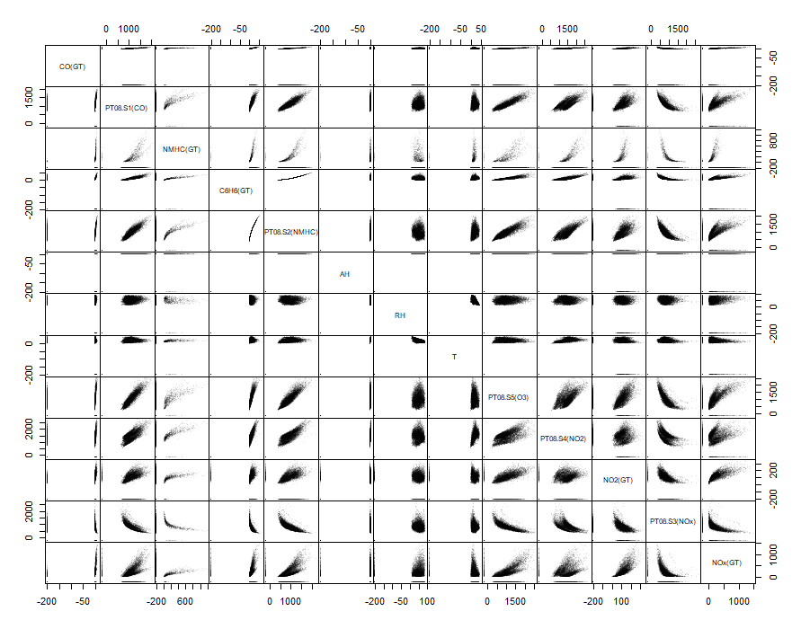
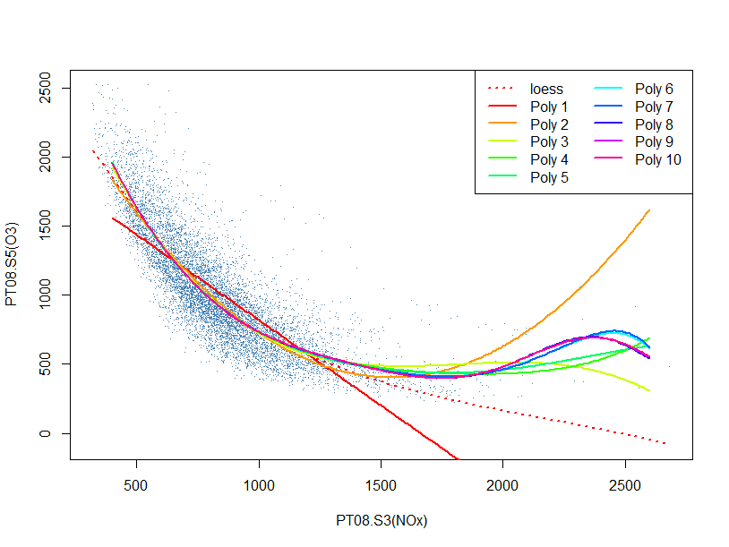

# Artificial Intelligence Principles - Challenges

32318/1700/1920/1/22
D'Haese David

---

## Air Quality

This data set contains 9357 readings from several sensors measuring air humidity, temperature as well as the concentration of gasses such as carbon dioxide, ozone, etc…. Here is,  for illustration purposes, a correlogram of most of the features:

### Challenge III.01

In small groups, appointed by the teacher, try to figure out how to use machine learning to estimate the ideal degree of the polynomial to fit cloud of data (shown as steelblue dots in the plot below) generated by plotting the variables `PT08.S5(O3)` against `PT08.S3(NOx)`.

The dotted red line in the plot is the result of a type of __local regression__ called loess, i.e. a regression that only considers neighbouring points to decide how to draw the line, allowing for __complex, low-parametric curved function__ to be generated. In other words, this line does not have a simple formula but is drawn solely based on the data! In contrast, the solid lines are generated from polynomial models (thus parametric and having a simple mathematical formula to describe it) with differing degrees (of complexity). For example, `Poly 2` stands for a function of the type:

$$y=ax^2+bx+c$$

Create a Jupyter Notebook that answers the question of the ideal polynomial degree. Make use of a _training set_, a _test set_, and apply _cross validation_ on the training set. Look up the theory of these terms if you do not remember what they mean.
